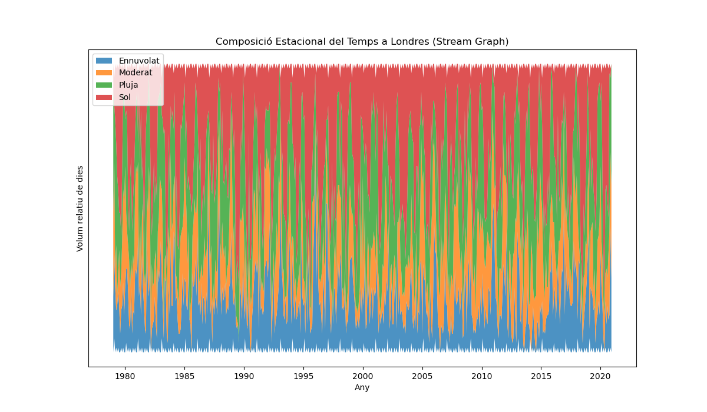

# uoc-pac2-vis

## PAC 2: Visualització de Dades (UOC)

Aquest repositori conté el lliurament de la PAC 2 de l'assignatura M2.959 - Visualització de Dades.

* **Estudiant:** Arnau Toledano Rubí
* **Assignatura:** M2.959 - Visualització de Dades
* **Tècniques assignades:** Gràfic Circular (Pie Chart), Gràfic de Corrent (Stream Graph) i Gràfic d'Horitzó (Horizon Graph).

---

## 🔗 Enllaç al Treball (URL Públic)

L'anàlisi completa, el codi font i les visualitzacions generades es troben al següent Jupyter Notebook renderitzat per GitHub:

* **[https://github.com/arnau-toledano2/uoc-pac2-vis/blob/main/PAC2_Visualitzacions.ipynb](https://github.com/arnau-toledano2/uoc-pac2-vis/blob/main/PAC2_Visualitzacions.ipynb)**

---

## Resum de les Visualitzacions

A continuació es mostra un resum de les tres tècniques analitzades i les visualitzacions generades.

### 1. Gràfic Circular (Pie Chart)

* **Definició:** Un gràfic circular que representa proporcions de "part-a-tot".
* **Dades:** S'ha utilitzat un dataset sobre [Menciona el teu dataset, p.ex., "quotes de mercat de navegadors web"].
* **Objectiu:** Mostrar la quota dominant d'una categoria sobre les altres.

### 2. Gràfic de Corrent (Stream Graph)

* **Definició:** Una variant del gràfic d'àrees apilades que representa l'evolució de volums al llarg del temps al voltant d'un eix central.
* **Dades:** S'ha utilitzat un dataset sobre [Menciona el teu dataset, p.ex., "popularitat de gèneres musicals al llarg de 20 anys"].
* **Objectiu:** Visualitzar la dinàmica i les tendències canviants entre diverses categories al llarg del temps.

### 3. Gràfic d'Horitzó (Horizon Graph)

* **Definició:** Una tècnica de visualització compacta per a múltiples sèries temporals, que "plega" les dades en bandes de color per estalviar espai.
* **Dades:** S'ha utilitzat un dataset sobre [Menciona el teu dataset, p.ex., "l'evolució del preu de 5 accions"].
* **Objectiu:** Monitoritzar i comparar patrons i volatilitat de moltes sèries temporals simultàniament en un espai reduït.

---

## ⚙️ Com executar el projecte

1.  Clonar el repositori: `git clone https://github.com/arnau-toledano2/uoc-pac2-vis.git`
2.  Instal·lar les dependències: `pip install -r requirements.txt`
3.  Obrir el Jupyter Notebook: `jupyter notebook PAC2_Visualitzacions.ipynb`