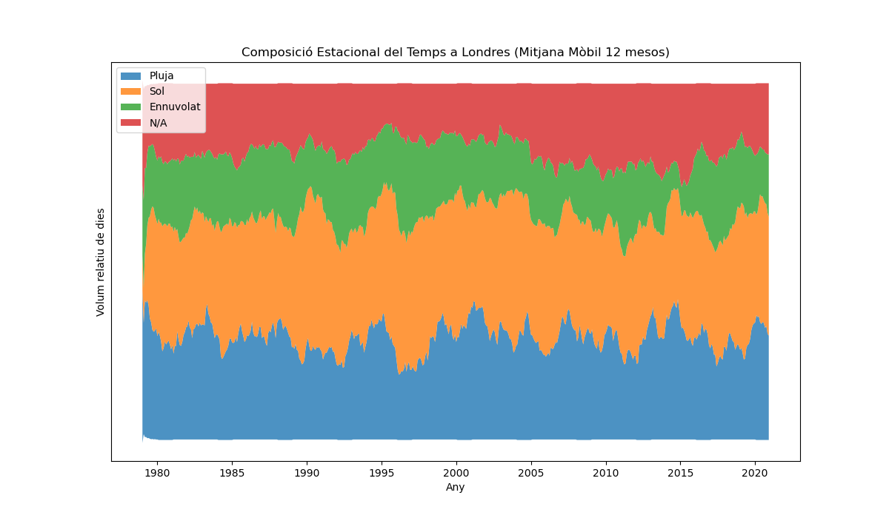
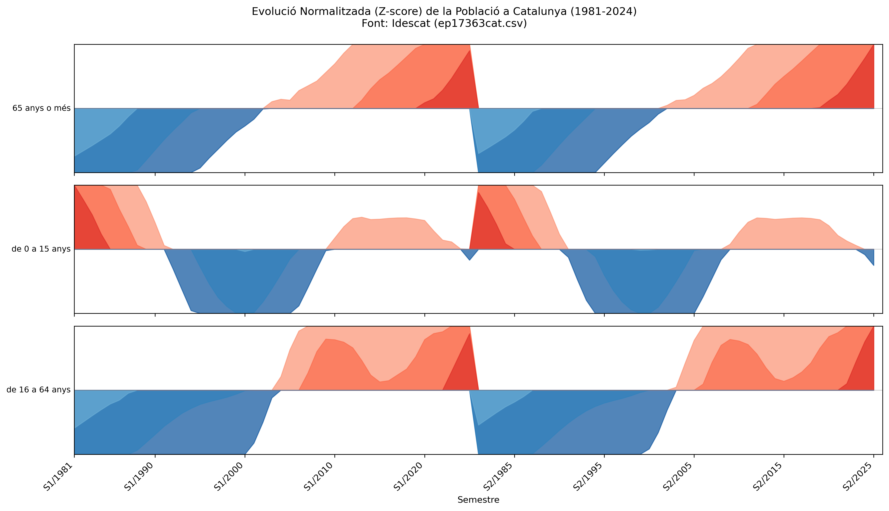

# uoc-pac2-vis

## PAC 2: Visualització de Dades (UOC)

Aquest repositori conté el lliurament de la PAC 2 de l'assignatura M2.959 - Visualització de Dades.

* **Estudiant:** Arnau Toledano Rubí
* **Assignatura:** M2.959 - Visualització de Dades
* **Tècniques assignades:** Gràfic Circular (Pie Chart), Gràfic de Corrent (Stream Graph) i Gràfic d'Horitzó (Horizon Graph).

---

## 🔗 Enllaç al Treball (URL Públic)

L'anàlisi completa, el codi font i les visualitzacions generades es troben al següent Jupyter Notebook renderitzat per GitHub:

* **[https://github.com/arnau-toledano2/uoc-pac2-vis/blob/main/PAC2_Visualitzacions.ipynb](https://github.com/arnau-toledano2/uoc-pac2-vis/blob/main/PAC2_Visualitzacions.ipynb)**

---

## Resum de les Visualitzacions

A continuació es mostra un resum de les tres tècniques analitzades i les visualitzacions generades.

### 1. Gràfic Circular (Pie Chart)

* **Definició:** Un gràfic circular clàssic que representa proporcions numèriques de "part-a-tot", on cada sector circular és proporcional a la quantitat que representa.

* **Dades:** S'han utilitzat les **Estimacions Provisionals de Població de l'Idescat** a 1 de gener de 2024, distribuïdes pels tres grans grups d'edat.

* **Objectiu:** Mostrar l'estructura demogràfica de la població a Catalunya, permetent una comprensió visual immediata del "pes" de la població jove, la població activa i la gent gran sobre el total.

Enllaç: [https://www.idescat.cat/dades/obertes/ep](https://www.idescat.cat/dades/obertes/ep)

### 2. Gràfic de Corrent (Stream Graph)

Una variant del gràfic d'àrees apilades que representa l'evolució de volums al llarg del temps al voltant d'un eix central mòbil, donant-li una forma orgànica.

* **Dades:** S'ha utilitzat el dataset "London Weather Data" (1979-2020). Les dades s'han transformat: cada dia s'ha categoritzat ('Pluja', 'Sol', 'Ennuvolat', 'N/A') i s'ha agrupat el recompte total per mes.

* **Transformació Clau:** Per eliminar el soroll de la variació mes a mes i revelar els patrons estacionals, s'ha aplicat una **mitjana mòbil (rolling average) de 12 mesos** a les sèries temporals.

* **Objectiu:** Visualitzar la dinàmica i els **patrons estacionals** del clima a Londres, observant clarament les "onades" anuals (p.ex., l'augment de dies de 'Sol' a l'estiu i de 'Pluja' a l'hivern).

Enllaç: [https://www.kaggle.com/datasets/emmanuelfwerr/london-weather-data](https://www.kaggle.com/datasets/emmanuelfwerr/london-weather-data)

### 3. Gràfic d'Horitzó (Horizon Graph)

* **Definició:** Una tècnica de visualització compacta dissenyada per mostrar i monitoritzar **múltiples sèries temporals** en un espai vertical reduït, plegant les dades en bandes de color.
* **Dades:** S'ha utilitzat la sèrie històrica (1981-2024) de les **Estimacions Provisionals de Població de l'Idescat** (`ep17363cat.csv`), desglossada pels tres grans grups d'edat.
* **Transformació Clau:** Donat que les escales absolutes són diferents (el grup de 16-64 anys és molt més gran que els altres), les dades s'han **normalitzat (Z-score)**. Això ens permet comparar el seu **patró d'evolució relatiu** en lloc dels seus valors absoluts.
* **Objectiu:** Comparar les tendències demogràfiques de llarg termini, identificant patrons de creixement (o decreixement) relatiu entre la població jove, adulta i la gent gran a Catalunya.

Enllaç: [https://www.idescat.cat/dades/obertes/ep](https://www.idescat.cat/dades/obertes/ep)

---

## ⚙️ Com executar el projecte

1.  Clonar el repositori: `git clone https://github.com/arnau-toledano2/uoc-pac2-vis.git`
2.  Instal·lar les dependències: `pip install -r requirements.txt`
3.  Obrir el Jupyter Notebook: `jupyter notebook PAC2_Visualitzacions.ipynb`